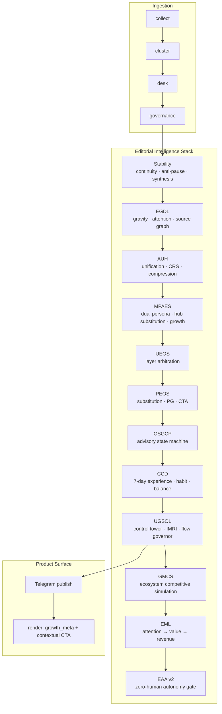

# Editorial Intelligence OS — Full Architecture (PEOS → UGSOL → GMCS → EML → EAA)

North Star: **one intelligent hub channel replaces 10–20 Telegram sources** — an autonomous cognitive media replacement engine with ecosystem competitive simulation, editorial-safe monetization, and AI autonomy.

## Unified Stack Diagram



## Final Authority: UGSOL Control Tower

All layers provide **signals**. Only `ugsol/control_tower.py` emits `FinalEditorialDecision.publish`.

### Layer signal order

1. Stability → EGDL → AUH → MPAES → UEOS → PEOS → OSGCP → CCD → **UGSOL (publish)** → GMCS → EML → **EAA (autonomy gate)** → publish

### Control Tower output

```text
FinalEditorialDecision {
  publish, mode, priority_level, audience_target, growth_action, reasoning_chain
}
```

## Layer Responsibilities

| Layer | Question it answers |
|-------|---------------------|
| Stability | Can the channel stay alive? |
| EGDL | What deserves attention? |
| AUH | Will the user understand it? |
| UEOS | Is the editorial decision coherent? |
| PEOS | Should this exist (substitution value)? |
| OSGCP | What actually ships right now? |
| CCD | Does it fit the weekly cognitive rhythm? |
| MPAES | Does it serve both hub readers and replace external stacks? |
| UGSOL | Final publish authority + IMRI + flow + feedback loop |

---

# UGSOL — Unified Growth & Stability Orchestration

## System Objective Function

**Maximize:** `substitution_per_attention × return_frequency × cross_persona_resonance × temporal_continuity`

**NOT optimizing:** volume, raw reach, post count, source diversity alone.

## IMRI (Information Market Replacement Index)

```
IMRI = 0.30×substitution + 0.25×forward + 0.20×save + 0.15×return + 0.10×cross_domain
```

| IMRI | Mode |
|------|------|
| ≥ 80 | dominance (aggressive growth) |
| 60–79 | stable growth |
| < 60 | recovery |

## Modules

| Module | Role |
|--------|------|
| `control_tower.py` | Sole publish authority |
| `audience_dominance_balancer.py` | male 0.55 / female 0.45 dynamic balance |
| `imri.py` | Information market replacement score |
| `content_flow_governor.py` | spacing, format caps, synthesis injection |
| `feedback_reinjection.py` | Learn from forwards/saves/return, not raw views |
| `objective_function.py` | System-wide optimization target |
| `system_simulator.py` | volatility / silent / mixed day scenarios |

## Flow Constraints

| Rule | Constraint |
|------|------------|
| max_gap | ≤ 90 min |
| target_gap | 45–60 min |
| flagship/day | 0–2 |
| digest/day | 1–2 |
| synthesis | auto on starvation |

---

# GMCS — Global Multi-Channel Competitive Simulation

Simulates hub channel vs 10 archetypal Telegram competitors (macro wires, geo breaking, crypto signals, RU aggregators, etc.).

| Output | Meaning |
|--------|---------|
| MDI (Market Dominance Index) | Position vs ecosystem |
| aggregate_win_rate | Substitution probability |
| channels_substituted_estimate | External channels replaced |

---

# EML — Editorial Monetization Layer

**Attention → cognitive value → revenue abstraction** without editorial spam.

| Gate | Rule |
|------|------|
| Breaking | monetization blocked |
| Low cognitive value | organic only |
| High trust + substitution | premium / syndication candidate |

Bridges to existing `app/monetization/` (W5 revenue engine).

---

# EAA v2 — Editorial AI Autonomy

Final gate before publish path:

| Mode | Behavior |
|------|----------|
| `human_required` | manual review path |
| `ai_assisted` | rules + AI confidence ≥ threshold |
| `zero_human` | `EDITORIAL_ZERO_HUMAN_IN_LOOP=true` |

Safety envelope: unverified breaking, spam patterns, harm patterns.

---

# MPAES — Multi-Persona Adaptive Editorial System

## Product Vision

Modern **intelligent information hub**: the reader opens one channel instead of 10–20 (macro wires, geo breaking, crypto, local city, business, AI). Content must be **trusted and unique** for male and female readers — same density, gender-neutral clarity, impact-first framing.

## Reference Reader Model (operator archetype)

Modeled from overloaded multi-channel consumption pattern:

| Typical subscriptions | Hub vertical |
|---------------------|--------------|
| Canada / diaspora news, macro wires | macro, geopolitics |
| Economy, central banks, markets | macro, markets |
| SVO / geo breaking | geopolitics |
| Crypto signal channels | crypto |
| Local city / regional | local |

Persona: `REFERENCE_OPERATOR_MALE` in `app/editorial/mpaes/persona_registry.py` — used as calibration anchor, not exclusive audience.

## Dual Segments

| Segment | Framing | Trust signals |
|---------|---------|---------------|
| Hub Male | direct implication, structural context | verified sources, evening wrap |
| Hub Female | impact on decisions, context-first | gender-neutral clarity, no hype |

Forbidden: masculine-coded hype, lifestyle noise, 10-source recap, subscribe spam.

## Operational Strategy (stability + aggressive growth)

| Pillar | Tactic | Layer |
|--------|--------|-------|
| **No long pauses** | anti-pause at 75 min, synthesis/elastic fill, max gap 90 min | Stability + OSGCP |
| **Relevance** | decision gate + «почему важно» injection | MPAES + AUH |
| **Frequency** | CCD slot cadence; pre-pause acceleration | CCD + MPAES posture |
| **Attractiveness** | cross-domain synthesis, flagship on T1 multi-source | PEOS + MPAES source affinity |
| **Growth** | reference forward > subscribe; persona-aware hashtags | MPAES + UEOS + PEOS CTA |

`MPAES_GROWTH_AGGRESSION=high` enables forward hooks on substitution score ≥ 55 without generic spam.

## Growth Tools (Telegram-native)

- **Hashtags**: UEOS v2 + MPAES discovery tags (`#MacroFlow`, `#GeoShift`, `#HubDigest`, `#MustRead`)
- **Source intelligence**: vertical affinity map → T1/T2 tier mix per topic
- **Forward hooks**: segment-specific («один пост вместо 10 каналов»)
- **Breaking**: interrupt only, no CTA
- **Evening digest**: closure anchor — «заменяет 10 каналов на сегодня»

## MPAES Modules

| Module | Role |
|--------|------|
| `persona_registry.py` | Hub male / female / reference operator profiles |
| `hub_substitution_map.py` | 10–20 channel archetypes → vertical coverage |
| `cognitive_segmentation.py` | Per-segment relevance, trust, overload |
| `narrative_adapter.py` | Dual-audience framing + implication injection |
| `growth_acquisition.py` | Discovery hashtags, forward hooks |
| `source_affinity.py` | Intelligent source selection by vertical |
| `operations_strategy.py` | Stability + growth posture per publish gap |
| `controller.py` | `enrich_draft_with_mpaes`, `apply_mpaes_to_decision` |

---

# CCD — 7-Day Cognitive Content Design

## Daily Rhythm (every day)

| Time | Mode | User expectation |
|------|------|----------------|
| Morning (6–11) | Orientation | «Что происходит в мире сейчас» |
| Midday (11–17) | Intelligence | «Что меняется прямо сейчас» |
| Evening (17+) | Compression | «Что это значит» |

## Weekly Semantic Focus

| Day | Focus |
|-----|-------|
| Monday | Macro reset |
| Tuesday | Tech / AI acceleration |
| Wednesday | Market + policy |
| Thursday | Geopolitical structural shifts |
| Friday | Business + earnings review |
| Saturday | Deep explainers / synthesis |
| Sunday | Future trends + reflection digest |

## Habit Anchors

- **Morning Brief** — retention anchor (orientation)  
- **Evening Wrap** — closure anchor (compression)  
- **Breaking** — interrupt anchor (signal only, no spam CTA)

## Category Balance (weekly targets)

| Category | Share |
|----------|-------|
| Macro / Economy | 18–22% |
| AI / Tech | 18–22% |
| Geopolitics | 15–18% |
| Markets | 12–15% |
| Business | 10–12% |
| Energy | 5–8% |
| Science / Trends | 5–8% |
| Explainers | 10–15% |

Hard rule: **no category > 35% of daily output**.

---

# Telegram-Native Growth Machine Blueprint

Product layer without code spam — growth via **reference behavior**, not subscribe CTAs.

## Growth Loop (PEOS + Channel Product)

```
Awareness → Trust → Reference → Return → Habit → Dependency
     ↓         ↓         ↓          ↓        ↓          ↓
impressions saves   forwards    DAU     streak   substitution_rate
```

## Reference-First Mechanics

| Trigger | When | CTA style |
|---------|------|-----------|
| Insight post | cross-domain implication | «перешлите коллеге, если влияет на вашу сферу» |
| Explainer | mental model post | «сохраните — объяснение будет актуально» |
| Digest | evening wrap | «заменяет 10 каналов на сегодня» |
| Breaking | PG ≥ 85 | none or minimal |

## What NOT to do

- Generic «подписывайтесь / follow us» on every post  
- 10-source recap without synthesis  
- Duplicate RU macro stream reporting  
- News without «why it matters in 1 sentence»

## Product KPIs (truth metrics)

| KPI | Layer |
|-----|-------|
| substitution_rate | PEOS / CSE |
| forwards_per_post | Telegram analytics |
| saves_per_post | Telegram analytics |
| morning_brief_open_rate | CCD habit anchor |
| evening_wrap_completion_rate | CCD habit anchor |
| weekly_return_rate | CCD persona simulation |
| continuity_gap_max | OSGCP / Stability |
| overload_rate | CCD journey simulator |
| dual_audience_trust | MPAES segmentation |
| hub_substitution_score | MPAES hub map |

## Env Flags (full stack)

```
EDITORIAL_STABILITY_LAYER=true
EDITORIAL_GROWTH_DOMINANCE_LAYER=true
EDITORIAL_AUDIENCE_UNIFICATION_LAYER=true
EDITORIAL_MPAES_LAYER=true
EDITORIAL_UGSOL_LAYER=true
EDITORIAL_GMCS_LAYER=true
EDITORIAL_EML_LAYER=true
EDITORIAL_EAA_V2_LAYER=true
EDITORIAL_ZERO_HUMAN_IN_LOOP=false
EDITORIAL_UNIFIED_OPERATING_SYSTEM=true
EDITORIAL_PRODUCT_OS=true
EDITORIAL_OSGCP=true
EDITORIAL_CCD_LAYER=true
MPAES_GROWTH_AGGRESSION=high
CHANNEL_PRODUCT_SHARE_NUDGE=true
```

## System Intent

Not a news pipeline. An **Adaptive Cognitive Information OS** that:

- guarantees continuous high-value flow (OSGCP + Stability)  
- optimizes for replacing external feeds (PEOS)  
- shapes a predictable weekly experience (CCD)  
- adapts narrative for male + female hub readers (MPAES)  
- grows through reference forwarding, not volume (Channel Product)

## Simulation Tools

| Module | Purpose |
|--------|---------|
| `app/editorial/osgcp/simulation.py` | 24h high/low/mixed signal days |
| `app/editorial/ccd/user_journey_simulator.py` | 4 interest personas, overload/satisfaction |
| `app/editorial/mpaes/cognitive_segmentation.py` | Dual demographic hub fit |

Run tests: `pytest tests/test_ugsol.py tests/test_gmcs.py tests/test_eml.py tests/test_eaa.py tests/test_mpaes.py`
