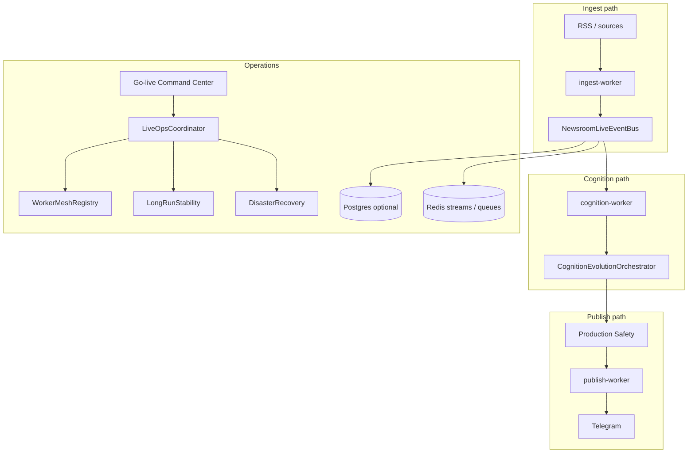

# Live Operations & Scale Readiness

Final pre-launch layer for continuous public Telegram publishing, horizontal scale, and multi-day autonomous operation.

## Architecture overview



## Components

| Module | Role |
|--------|------|
| `bot/live_ops/contracts.py` | Typed live events with schema validation |
| `bot/live_ops/event_bus.py` | Async bus: correlation IDs, DLQ, replay, backpressure hooks |
| `bot/live_ops/storage/abstraction.py` | SQLite/Postgres + Redis queues, locks, idempotency |
| `bot/live_ops/workers/` | Horizontal worker roles + CLI entrypoints |
| `bot/live_ops/recovery/` | RECOVERY_MODE startup, snapshots, replay integrity |
| `bot/live_ops/stability/` | Rolling stability score, 24h drift detection |
| `bot/live_ops/tenancy/` | Channel-scoped config foundations (not full SaaS) |
| `bot/live_ops/cognition/` | Editorial voting, timelines, contradiction hints |
| `bot/live_ops/command_center/` | `/go_live_check`, `/system_risk`, etc. |

## Event contracts

Core events: `StoryIngested`, `StoryClustered`, `CognitionCompleted`, `PublishCandidateCreated`, `PublishApproved`, `PublishBlocked`, `PublishDelivered`, `IncidentCreated`, `RolloutChanged`.

Emit via:

```python
from bot.live_ops.context_holder import get_live_ops
from bot.live_ops.bridge import emit_story_ingested

live_ops = get_live_ops()
if live_ops:
    await emit_story_ingested(live_ops, story_id=1, source="rss")
```

## Storage migration strategy

1. **Phase 0 (default):** SQLite primary, in-memory or Redis streams for events.
2. **Phase 1:** Set `REDIS_ENABLED=true` for queues, locks, idempotency cache.
3. **Phase 2:** Set `NEWSROOM_USE_POSTGRES=true` + `DATABASE_URL` — ping validates Postgres.
4. **Phase 3:** `NEWSROOM_DUAL_WRITE=true` during cutover; compare counts via recovery snapshots.

Local stack: `deploy/staging/docker-compose.staging.yml` (Postgres + Redis + Prometheus/Grafana).

## Worker topology

| Worker | Queues | Responsibility |
|--------|--------|----------------|
| ingest-worker | ingest | Source fetch, StoryIngested |
| cognition-worker | cognition | AI pipeline, CognitionCompleted |
| publish-worker | publish | Approval + Telegram delivery |
| operator-worker | operator | Human-in-the-loop commands |
| metrics-worker | metrics | Prometheus scrape helpers |
| recovery-worker | recovery | Replay, orphan cleanup |

Run standalone:

```bash
python -m bot.live_ops.workers.cli ingest --node-id ingest-1
```

Docker overlay: `deploy/live-ops/docker-compose.workers.yml`.

## Environment flags

| Variable | Default (staging) | Purpose |
|----------|-----------------|--------|
| `LIVE_OPS_ENABLED` | auto on staging/production | Master switch |
| `RECOVERY_MODE` | false | Force startup replay |
| `DEGRADED_STARTUP` | false | Allow boot with recovery issues |
| `NEWSROOM_USE_POSTGRES` | false | Postgres backend |
| `REDIS_ENABLED` | staging true | Redis queues/locks |
| `NEWSROOM_DUAL_WRITE` | false | Dual-write migration |
| `STREAM_BACKEND` | redis_streams in cluster | Durable event stream |

## Go-live command center

Operator Telegram commands (admin-only):

- `/go_live_check` — rollout readiness + blockers
- `/system_risk` — reliability + safety + stability
- `/publish_pressure` — queue + bus DLQ + Telegram pacing
- `/tenant_status` — per-channel/tenant scopes
- `/worker_mesh` — registered workers + stale detection
- `/recovery_state` — last recovery report
- `/eventbus_live` — pending, DLQ, handler counts

HTTP: `GET /live_ops` on the health server (port 8080 in staging).

## Recovery procedures

1. Set `RECOVERY_MODE=true` and restart — replays up to 200 stream events.
2. Export snapshot: recovery manager writes `var/recovery/snapshot_*.json`.
3. If replay integrity fails: use `DEGRADED_STARTUP=true` only with operator approval.
4. Rollback rollout: `/rollout_rollback` (production safety) — mirrored to `RolloutChanged` on live bus.

## Observability

Prometheus metrics (Grafana-ready):

- `live_ops_events_total{event_type,outcome}`
- `live_ops_cognition_duration_seconds`
- `live_ops_publish_latency_seconds{channel_id}`
- `live_ops_stability_score`
- `live_ops_rollout_transitions_total`
- `live_ops_story_lifecycle_total{stage}`

OpenTelemetry: existing `init_tracing()` in `bot/main.py` covers the operator node.

## Production scaling notes

- Scale ingest/cognition/publish workers independently; each registers heartbeats in `WorkerMeshRegistry`.
- Keep operator + publish on low-latency nodes; cognition can burst on GPU/API quota.
- Monitor `live_ops_stability_score` — below 0.65 triggers go-live blockers.
- Prefer Redis streams (`STREAM_BACKEND=redis_streams`) before multi-node go-live.

## Related runbooks

- `docs/RELIABILITY_RUNBOOK.md`
- `docs/PRODUCTION_SAFETY_RUNBOOK.md`
- `docs/PRODUCTION_GO_LIVE_CHECKLIST.md`
