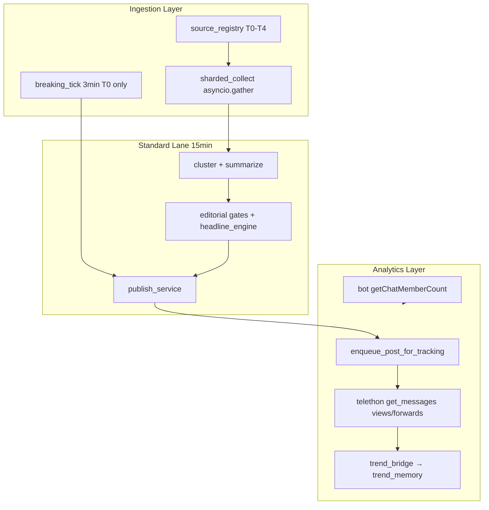

# W1 Implementation Sprint — Growth Architecture

Production implementation for Telegram AI newsroom: analytics, breaking lane, floor safety, source expansion, cadence unlock, headline intelligence, parallel ingestion.

---

## 1. Architecture Redesign



**Single-pipeline → multi-lane:**
| Lane | Interval | Sources | Gate | Cadence |
|------|----------|---------|------|---------|
| Standard | 15 min | T0–T4 | Full premium | Dynamic cap 18–25/day |
| Breaking | 3 min | T0 only | Floor eligibility + fast_publish | Bypass interval, cooldown 600s |
| Floor | On stall 45+ min | Pending only | **Full premium** (no safety_only) | Leadership bypass only |

---

## 2. Module / File Structure

```
app/
  analytics/
    __init__.py
    engagement_scoring.py      # engagement + virality formulas
    telegram_stats.py          # poll, enqueue, retention
    trend_bridge.py            # real metrics → trend_memory
    scheduler_jobs.py          # APScheduler tick
  lanes/
    breaking_pipeline.py       # T0 breaking tick
  sources/
    registry.py                # CURATED_25, tiers, shard helpers
  ops/
    floor_eligibility.py       # W1 safe floor scoring
  editorial/
    cadence_dynamic.py         # engagement-aware caps
    headline_engine.py         # entity-first headlines
collector/
  sharded_collect.py           # parallel gather + backpressure
db/models.py                   # post_performance, channel_audience_snapshots, source_registry
```

---

## 3. DB Schemas

### `post_performance`
| Column | Type | Notes |
|--------|------|-------|
| id | INTEGER PK | |
| draft_id | INTEGER FK nullable | NULL for breaking lane |
| telegram_post_id | INTEGER | indexed |
| channel_id | INTEGER | indexed |
| published_at | DATETIME | indexed |
| snapshot_label | VARCHAR(16) | t0, t1h, t6h, t24h |
| snapshot_at | DATETIME | indexed |
| views, forwards, reactions_total | INTEGER | |
| subscribers_at_snapshot | INTEGER | |
| engagement_score, virality_score | FLOAT | |
| primary_source | VARCHAR(255) | source correlation |
| topic_bucket | VARCHAR(64) | topic correlation |
| publish_hour_local | INTEGER | hour-of-day analysis |
| extras_json | TEXT | pending_snapshots |

**Indexes (SQLite auto + recommended):**
- `(telegram_post_id, snapshot_label)`
- `(published_at DESC)`
- `(topic_bucket, snapshot_label)`
- `(primary_source, snapshot_label)`

### `channel_audience_snapshots`
| Column | Type |
|--------|------|
| channel_id, captured_at, member_count, delta_24h, delta_7d |

### `source_registry`
| Column | Type |
|--------|------|
| handle UNIQUE, tier T0-T4, vertical, poll_interval_sec, trust_score, status, probation_until, fail_streak |

---

## 4. Scheduler Redesign

| Job ID | Interval | Function |
|--------|----------|----------|
| newsroom_pipeline | 15 min | collect → cluster → publish |
| breaking_lane | **3 min** | `run_breaking_tick` |
| telegram_analytics | **15 min** | poll metrics + audience + purge |
| newsroom_operational_heartbeat | 5 min | existing |

Env: `BREAKING_LANE_INTERVAL_MIN=3`, `TELEGRAM_ANALYTICS_INTERVAL_MIN=15`

---

## 5. Queue Topology

```
breaking_lane (priority, no draft queue)
  └─ cooldown state: runtime/breaking_lane_state.json

standard pipeline
  └─ pending drafts → rank → publish arbitration

failed_drafts (existing retry queue, unchanged)

analytics (async poll, not blocking publish)
  └─ post_performance pending_snapshots queue in extras_json
```

---

## 6. Key Pseudocode

### Floor eligibility
```
body = polish_channel_post(draft.content)
IF truncated OR ads OR sentences < 2 OR NOT premium_policy: REJECT
score = base + sentence_bonus + relevance
IF score >= FLOOR_MIN_ELIGIBILITY_SCORE: ELIGIBLE
```

### Breaking tick
```
IF now - last_publish < BREAKING_COOLDOWN_SEC: return
posts = fetch T0 last 5 messages
FOR p IN posts DESC:
  IF breaking_keyword AND hash not in recent: candidate = p
summary = rule_based_summary(candidate.text)
IF evaluate_floor_eligibility(summary): publish_breaking_item()
```

### Dynamic cadence
```
cap = GROWTH_CADENCE_DAILY_CAP + engagement_boost * 10
IF count >= cap: BLOCK
IF hour_count >= session_cap: BLOCK
IF breaking: ALLOW (interval=30s)
```

### Engagement score
```
forward_rate = min(1, forwards/views * 25)
reaction_rate = min(1, reactions/views * 40)
engagement = 0.35*forward + 0.25*reaction + 0.25*view_rate + 0.15*velocity
```

---

## 7. Environment Configs

See `deploy/timeweb/.env.example`:
- `GROWTH_CADENCE_DAILY_CAP=20`, `GROWTH_PHASE=d30`
- `TELEGRAM_ANALYTICS_*`, `BREAKING_LANE_*`
- `COLLECT_PARALLEL_ENABLED=true`, `COLLECT_SHARD_SIZE=3`
- `FLOOR_MIN_ELIGIBILITY_SCORE=0.72`
- `HEADLINE_ENGINE_ENABLED=true`
- `SOURCE_REGISTRY_EXPAND=false` (set true after Telethon session validated for 25 sources)

---

## 8. Migration Order

1. Deploy code (create_all adds new tables on startup)
2. Restart container → SQLite WAL creates `post_performance`, `channel_audience_snapshots`, `source_registry`
3. First analytics tick → audience baseline
4. Set `SOURCE_REGISTRY_EXPAND=true` when ready → seeds CURATED_25
5. Raise `GROWTH_CADENCE_DAILY_CAP` to 20 after 48h stable metrics

No destructive migrations. Roll forward only.

---

## 9. Rollout Strategy

**Phase A (Day 0):** Deploy floor safety + analytics enqueue (read-only metrics).  
**Phase B (Day 1):** Enable breaking lane with 3 T0 sources already in SOURCE_CHANNELS.  
**Phase C (Day 3):** `SOURCE_REGISTRY_EXPAND=true`, parallel collect, cap=18.  
**Phase D (Day 7):** cap=22, headline A/B via hook_variant in trend_memory.  
**Phase D30:** cap=25, 25 sources, review engagement dashboards.

---

## 10. Rollback Strategy

| Component | Rollback |
|-----------|----------|
| Floor | `PUBLISH_FLOOR_ENABLED=false` |
| Breaking | `BREAKING_LANE_ENABLED=false` |
| Analytics | `TELEGRAM_ANALYTICS_ENABLED=false` |
| Parallel collect | `COLLECT_PARALLEL_ENABLED=false` |
| Cadence | `GROWTH_CADENCE_DAILY_CAP=8` |
| Headlines | `HEADLINE_ENGINE_ENABLED=false` |

Git revert single commit if needed. DB tables harmless if unused.

---

## 11. Risk Analysis

| Risk | Mitigation |
|------|------------|
| FloodWait on 25 sources | Sharded collect, tier poll intervals, delay 0.5x in shards |
| Breaking spam | 600s cooldown, content hash dedupe |
| Floor silence | Breaking lane + alert on `publish_floor.no_eligible_candidate` |
| SQLite write contention | WAL + analytics batch 40; migrate PG at 40+ sources |
| Proxy failure | Existing xray refresh cron |

---

## 12. Testing Plan

```bash
pytest tests/test_floor_eligibility.py tests/test_publish_floor.py tests/test_engagement_scoring.py -q
pytest tests/test_public_post_formatter.py -q
```

Staging: publish 1 post → verify `post_performance` t0 row → wait 1h → t1h snapshot.

---

## 13. KPI Instrumentation

Log events: `analytics.post_enqueued`, `analytics.poll_complete`, `breaking.tick_complete`, `publish_floor.no_eligible_candidate`

Metrics: `engagement_score`, `virality_score`, `delta_24h`, posts/day from `dynamic_cadence_state.json`

Dashboard-ready query:
```sql
SELECT topic_bucket, AVG(engagement_score), COUNT(*) 
FROM post_performance WHERE snapshot_label='t6h' 
GROUP BY topic_bucket;
```

---

## 14. Performance Expectations

| Metric | Before | W1 Target |
|--------|--------|-----------|
| Collect 25 sources | ~75s serial | ~25s (3-shard parallel) |
| Breaking latency | N/A | <5 min (3 min tick + publish) |
| Analytics lag | N/A | t1h within 75 min |
| Posts/day | 6–8 | 18–25 (D30) |

---

## 15. Cost Expectations

- **LLM:** Breaking uses rule fallback → $0 extra; standard lane unchanged
- **VPS T1:** Sufficient until 40 sources; then consider T2 or PG sidecar
- **Telegram API:** No Bot API paid tier; Telethon user session limits apply

---

## 16. Production Hardening Checklist

- [ ] `TELEGRAM_BOT_PROXY` + `TELETHON_PROXY` verified
- [ ] `AUTO_PUBLISH_ENABLED=true`
- [ ] `GROWTH_CADENCE_DAILY_CAP=20`
- [ ] Breaking T0 sources subscribed in Telethon session
- [ ] Alert on 60+ min silence without floor candidate
- [ ] Backup `/data/newsroom.db` before SOURCE_REGISTRY_EXPAND

---

## 17. Priority Implementation Order

1. Floor safety (done)
2. Analytics enqueue + poll
3. Breaking lane
4. Parallel collect
5. Source registry seed
6. Cadence unlock
7. Headline engine

---

## 18. What I Would Code First

**Already coded first:** `floor_eligibility.py` + remove `safety_only` for floor — prevents reputation damage immediately.

**Next session:** Wire `evaluate_dynamic_cadence` into `editorial/cadence.py` publish gate (currently only state recording on publish).

---

## 19. Most Dangerous Production Failures

1. **Floor publishing truncated posts** — fixed via premium gate + truncation check
2. **Telegram API block without proxy** — monitor healthcheck
3. **Breaking duplicate spam** — hash dedupe + cooldown
4. **FloodWait cascade** — disable `COLLECT_PARALLEL_ENABLED` remotely
5. **False engagement on zero views** — snapshots wait t1h before trend_memory feed

---

## 20. Curated Initial 25 Sources

See `app/sources/registry.py` — macro (cb_economics, markets), finance (finamalert), geopolitics (bbbreaking, tass_agency), crypto (CoinDesk, cointelegraph), energy (oilpricecom), corporate (bloomberg, ReutersBiz, FT, WSJ).

Enable with `SOURCE_REGISTRY_EXPAND=true` after validating Telethon access to each handle.
