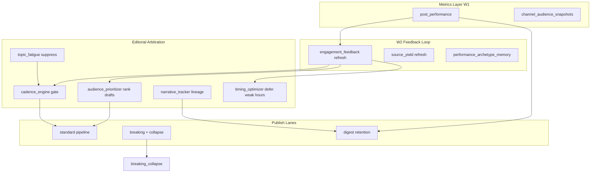

# W2 Implementation Sprint — Adaptive Growth Engine

Transition: stable AI newsroom → feedback-driven media engine.

---

## 1. W2 Architecture



**Control loop (every 15 min analytics tick):**
1. Poll Telegram metrics (W1)
2. `refresh_engagement_feedback()` → cache weights
3. `refresh_source_yield_scores()` → tier demotion/promotion
4. Publish decisions use cached weights (no hot-path DB aggregation)

---

## 2. Module / File Tree

```
app/growth/
  __init__.py
  cadence_engine.py          # W2.1 — wired into editorial/cadence.py
  engagement_feedback.py     # W2.3 — Bayesian topic/source/hour weights
  topic_fatigue.py           # W2.4 — saturation + entity overuse
  narrative_tracker.py       # W2.5 — narrative_id + continuation
  source_yield.py            # W2.6 — ROI scoring + auto tier
  performance_memory.py      # W2.7 — archetype/headline memory
  timing_optimizer.py        # W2.8 — hour heatmap defer
  breaking_collapse.py       # W2.9 — semantic event dedupe
  audience_prioritizer.py    # W2.10 — draft ranking
  feedback_job.py            # analytics tick hook

app/digest/
  intelligence.py            # W2.2 — assembly + ranking
  scheduler_jobs.py          # morning/evening/weekly windows

editorial/cadence.py         # + evaluate_growth_cadence_gate
publisher/publish_service.py # + record_growth_cadence_publish hooks
app/ops/autonomous_publish.py # + rank_pending_drafts_for_publish
app/lanes/breaking_pipeline.py # + breaking_collapse
app/analytics/scheduler_jobs.py # + growth feedback tick
app/main.py                  # + growth_digest job
```

---

## 3. DB Schemas

### `narrative_tracks`
| Column | Purpose |
|--------|---------|
| narrative_id | `narr:{hash}` stable ID |
| cluster_key | trend_memory cluster |
| momentum_score, importance_score | narrative momentum |
| publish_count | continuation weight |
| context_tokens_json | Jaccard continuation match |
| parent_narrative_id | lineage |
| status | active/archived |

### `performance_archetype_memory`
| Column | Purpose |
|--------|---------|
| archetype | short_pulse / entity_first / etc |
| headline_pattern | colon_split / lead_sentence |
| topic_bucket | macro/crypto/geo |
| avg_engagement, avg_virality | rolling mean |
| publish_hour_local | slot memory |

### `growth_digest_runs`
| Column | Purpose |
|--------|---------|
| digest_type | morning_briefing / evening_recap / weekly_key_events |
| diversity_score | topic spread 0..1 |
| content | HTML body |
| telegram_message_id | published ref |

---

## 4. State Models (JSON runtime)

| File | Contents |
|------|----------|
| `engagement_feedback_cache.json` | topic/source/hour weights, momentum, low_streak |
| `dynamic_cadence_state.json` | daily counts, topics, hours (W1) |
| `topic_fatigue_state.json` | decayed topic/entity/narrative counts |
| `publish_hour_heatmap.json` | raw hour → engagement sums |
| `breaking_collapse_state.json` | event fingerprints 2h window |
| `audience_preference_vectors.json` | vertical cohort affinity |

---

## 5. Scheduler Redesign

| Job | Interval | Function |
|-----|----------|----------|
| newsroom_pipeline | 15m | ingest → rank → publish |
| telegram_analytics | 15m | metrics + **growth feedback** |
| breaking_lane | 3m | T0 + **semantic collapse** |
| **growth_digest** | 60m | window-aware digest publish |

Digest windows (local TZ):
- 07–09 → morning_briefing
- 19–21 → evening_recap
- Sun 10–12 → weekly_key_events

---

## 6. Ranking Formulas

### Audience priority (draft selection)
```
score = 0.28*signal + 0.22*topic_aff + 0.18*cohort + 0.14*source_aff
      + 0.10*slot_aff + 0.08*novelty + momentum_boost
if low_engagement_streak >= 4: score *= 0.85
```

### Bayesian engagement rate
```
rate = (sum_scores + k * prior_mean) / (count + k)    # k=8, prior=0.35
```

### Source yield
```
yield = 0.55*avg_engagement + 0.35*avg_virality + 0.10*min(1, posts/10)
```

### Digest item rank
```
rank = 0.5*engagement + 0.35*virality + 0.15*headline_len_norm
```

---

## 7. Editorial Arbitration Logic

**Auto-publish order:**
1. `list_pending_drafts(limit=N)`
2. `rank_pending_drafts_for_publish()` — drops fatigue-suppressed
3. `evaluate_draft_for_auto_publish()` — existing policy gates
4. First passing draft → schedule

**Publish gate stack (in order):**
1. Quiet hours / min interval / burst (existing)
2. cadence_intelligence (theme spam)
3. **growth cadence engine** (dynamic cap, fatigue, timing, momentum interval)

---

## 8. Cadence Algorithms

```python
cap = base_cap + int(engagement_boost * 10)
if count >= cap: BLOCK
if hour_count >= session_cap: BLOCK
if fatigue.suppress: BLOCK
if hour_score < 0.22 and 8<=hour<=22: BLOCK (timing)
if now - last_publish < min_interval: BLOCK

# Momentum amplification
if momentum > 0.08: min_interval *= 0.85
if low_streak >= 3: min_interval *= 1.25; may BLOCK low-topic posts
```

Breaking: exempt from fatigue/timing; min_interval=30s; cap+4.

---

## 9. Narrative Tracking

- `resolve_narrative(text, category)` → narrative_id via cluster_key hash
- Jaccard(token_set, prev) ≥ 0.55 → continuation → same narrative_id
- `record_narrative_publish()` bumps momentum on real engagement (hook ready)
- Digest pulls top narratives for carryover lines (phase W2.1)

---

## 10. Fatigue Suppression

```
fatigue = min(1, 0.35*topic_count + 0.08*entity_hits + 0.25*narr_count)
suppress if fatigue >= 0.72 OR entity_hits >= 4
novelty = 1 - fatigue
decay half-life = 18h
```

Emergency override: `is_breaking=True` bypasses fatigue.

---

## 11. Digest Architecture

Pipeline:
1. `fetch_digest_candidates(since_hours)` from post_performance t6h/t24h
2. Diversity filter — max 1 per topic_bucket until 3 items
3. `assemble_digest_html()` — entity-first hierarchy
4. Quality gate: min 2 candidates, diversity ≥ implicit
5. Publish via Bot API HTML

---

## 12. Source Intelligence

Auto-actions (14d window, ≥3 posts):
| Condition | Action |
|-----------|--------|
| yield < 0.22 | status → probation |
| yield ≥ 0.55 + probation | status → active |
| yield ≥ 0.62, 8+ posts | T3→T2, T2→T1 |
| yield < 0.18, 6+ posts | demote tier |

Stored in `source_registry.extras_json.yield_score`.

---

## 13. Publish Optimization Engine

- `evaluate_publish_timing()` defers posts in weak hours (score < 0.22)
- `record_publish_hour()` updates heatmap on metrics callback (future hook)
- Hour weights from engagement_feedback refresh

---

## 14. Queue Topology

Unchanged lane separation:
- Standard: pending drafts → ranked queue → publish
- Breaking: T0 poll → collapse gate → fast_publish
- Digest: async generation → single publish per window

Growth feedback: sidecar on analytics job (non-blocking).

---

## 15. Recovery Logic

- All weights in JSON cache — rebuilt every analytics tick from DB
- Empty cache → prior_mean=0.35 (safe default)
- Restart: no training required; first tick repopulates
- narrative_tracks / performance_archetype_memory persist in SQLite

---

## 16. Rollback Strategy

| Flag | Effect |
|------|--------|
| `GROWTH_CADENCE_ENGINE_ENABLED=false` | static cadence only |
| `GROWTH_FEEDBACK_ENABLED=false` | no weight refresh |
| `GROWTH_DIGEST_ENABLED=false` | no digest job |
| `GROWTH_TIMING_OPTIMIZER_ENABLED=false` | no hour defer |
| `BREAKING_COLLAPSE_WINDOW_SEC=0` | disable collapse (not recommended) |

---

## 17. KPI Instrumentation

Log events:
- `growth.feedback_tick_complete`
- `growth_cadence_*` (via publish_gate reasons)
- `breaking_collapsed:*`
- `digest.tick_complete`

SQL:
```sql
SELECT topic_bucket, AVG(avg_engagement) FROM performance_archetype_memory GROUP BY topic_bucket;
SELECT vertical, AVG(momentum_score) FROM narrative_tracks WHERE status='active';
```

---

## 18. Observability Metrics

- `global_engagement`, `momentum`, `low_engagement_streak`
- `sources_updated` per feedback tick
- Digest: `item_count`, `diversity_score`
- Publish blocks by reason prefix `growth_*`

---

## 19. Performance Expectations

| Operation | Latency |
|-----------|---------|
| feedback tick | <2s (14d scan, ~500 rows) |
| draft ranking (12 drafts) | <50ms (JSON cache) |
| cadence gate | <10ms |
| digest generation | <500ms |

---

## 20. Cost Expectations

- **$0 LLM** for digest (template assembly from metrics)
- **$0 extra VPS** on T1 until 40 sources
- SQLite sufficient until ~50k post_performance rows

---

## 21. Testing Strategy

```bash
python3 -m pytest tests/test_growth_w2.py tests/test_floor_eligibility.py -q
```

Staging:
1. Publish 3 posts different topics → verify fatigue blocks 4th same topic
2. Wait analytics tick → check `engagement_feedback_cache.json`
3. Trigger breaking twice same event → second collapsed
4. Run digest in 07-09 window → `growth_digest_runs` row

---

## 22. Failure Scenarios

| Failure | Mitigation |
|---------|------------|
| Empty metrics | Bayesian prior → neutral weights |
| Over-aggressive fatigue | raise `GROWTH_TOPIC_SATURATION_LIMIT` |
| Digest spam | 60m check + window gating |
| Source mass demotion | require min 3 posts before probation |
| Timing blocks all day | disable `GROWTH_TIMING_OPTIMIZER` |

---

## 23. Priority Implementation Order

1. ✅ Cadence engine wiring
2. ✅ Engagement feedback loop
3. ✅ Audience prioritizer + auto-publish rank
4. ✅ Topic fatigue + breaking collapse
5. ✅ Source yield
6. ✅ Performance memory + narrative DB
7. ✅ Digest scheduler
8. 🔜 Wire `resolve_narrative` at draft creation (scheduler/jobs)
9. 🔜 Update performance_memory with real engagement on t6h poll

---

## 24. What I Would Deploy First

**Already deployed in code:** cadence wiring + feedback tick + draft ranking.

**Enable on VPS first:**
```bash
GROWTH_CADENCE_ENGINE_ENABLED=true
GROWTH_FEEDBACK_ENABLED=true
```
Wait 48h for metrics → then enable digest.

---

## 25. What Can Destroy Growth If Implemented Badly

1. **Timing optimizer too aggressive** — channel goes silent in "weak" hours forever
2. **Fatigue threshold too low** — blocks all macro during active Fed week
3. **Source auto-demotion on 3 posts** — kills T0 before variance stabilizes
4. **Digest over-frequency** — audience unfollows
5. **Momentum interval collapse** — spam during viral spike

**Safety rails baked in:** breaking exempt, prior_mean fallback, min 3 posts for source actions, digest window gating.
