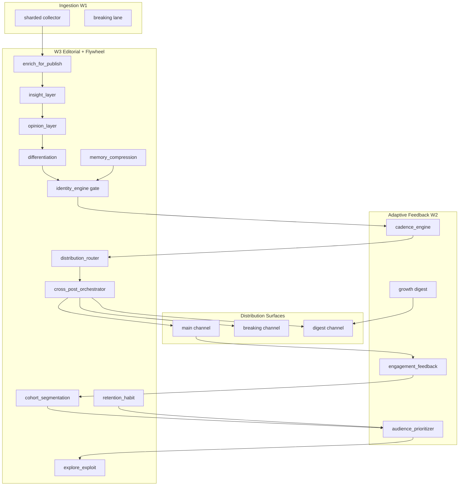

# W3 Implementation Sprint — Editorial Identity + Distribution Flywheel

Transition: adaptive automation newsroom → recognizable media entity with compounding distribution.

---

## 1. W3 Architecture Redesign



**Editorial decision pipeline (hot path):**
1. `draft_builder.polish_channel_post()` → `enrich_for_publish()` (insight + opinion + habit hook)
2. `headline_engine` (W1) applies voice-safe headline
3. `publish_service` → cadence gate → `evaluate_pre_publish_editorial()` → approve → send
4. Post-publish → style memory, differentiation record, cross-post digest mirror, distribution log

**Maintenance loop (every 6h):**
1. `refresh_cohort_memory()` — aggregate vertical affinity → `cohort_memory`
2. `compress_style_memory()` — top-performing patterns → `editorial_identity_vectors`

---

## 2. Module / File Structure

```
app/identity/
  style_guide.py           # tone rules, forbidden patterns, framing, score_style_alignment
  insight_layer.py         # implication extraction, score_insight_depth
  opinion_layer.py         # light uncertainty-aware framing
  differentiation.py       # anti-generic + shingle near-duplicate detection
  identity_engine.py       # evaluate_editorial_identity gate

app/flywheel/
  pipeline.py              # enrich_for_publish, evaluate_pre_publish_editorial
  distribution_router.py   # MAIN/BREAKING/DIGEST/DISCARD routing
  cross_post_orchestrator.py # dedupe, digest mirror, distribution audit log
  cohort_segmentation.py   # macro/crypto/geo cohort memory
  explore_exploit.py       # daily explore budget (bandit-lite)
  retention_habit.py       # morning/midday/evening habit slots
  memory_compression.py    # style → identity vector compression
  scheduler_jobs.py        # maintenance tick

app/publisher/draft_builder.py   # + enrich_for_publish hook
publisher/publish_service.py     # + W3 pre/post publish hooks
app/growth/audience_prioritizer.py # + explore_boost, habit_boost
app/main.py                      # + flywheel_maintenance job
db/models.py                     # editorial_style_memory, editorial_identity_vectors,
                                 # cohort_memory, distribution_flywheel_log
tests/test_flywheel_w3.py
```

---

## 3. DB Schemas

```sql
-- editorial_style_memory
id, vertical, headline_pattern, style_score, insight_score,
avg_engagement, sample_count, updated_at

-- editorial_identity_vectors (key='default')
id, key, vector_json, sample_count, updated_at
-- vector_json: {top_verticals, avg_style, avg_insight, dominant_patterns}

-- cohort_memory (unique cohort)
id, cohort, affinity_score, engagement_sum, sample_count, extras_json, updated_at

-- distribution_flywheel_log
id, draft_id, surface, channel_id, reason, content_hash,
mirrored_digest, created_at
```

Tables auto-created via SQLAlchemy metadata on startup (SQLite).

---

## 4. Editorial Decision Pipeline

| Stage | Module | Action |
|-------|--------|--------|
| Draft polish | `enrich_for_publish` | Add «Почему это важно», light framing |
| Headline | `headline_engine` | Voice-safe headline selection |
| Identity gate | `evaluate_pre_publish_editorial` | style + insight + routing + explore |
| Safety | `final_publish_gate` | advertising/governance/trust |
| Cadence | `cadence_engine` | session cap, fatigue, timing |
| Send | `publish_draft_to_channel` | Telegram HTML |
| Post | cross-post + memory | digest mirror, style memory, dedupe |

**Rejection reasons:** `shallow_insight`, `generic_opener`, `near_duplicate_structure`, `forbidden_voice`, `low_signal_routing`, `low_style_score`

**Bypass:** breaking lane, operator_override, explore mode (identity soft-fail allowed)

---

## 5. Ranking + Scoring Formulas

### Style alignment (`score_style_alignment`)
```
base = 0.55
+ 0.15 if no forbidden/generic violations
+ 0.18 if REQUIRED_SIGNAL match (market/geo/crypto keywords)
+ 0.12 if ≥2 substantive sentences
+ 0.10 if insight connector present
+ 0.05 if implication arrow/em-dash pattern
aligned = score ≥ 0.58 AND no violations
```

### Insight depth (`score_insight_depth`)
```
base = 0.35
+ 0.25 if «Почему это важно» / «Это означает»
+ 0.10 if len ≥ 280
+ 0.15 if ≥3 sentences
+ 0.15 if implication rule match
```

### Differentiation (Jaccard on 4-shingles)
```
reject if generic opener regex match
reject if max_jaccard(recent_30) ≥ 0.62
warn if max_jaccard ≥ 0.45
```

### Audience priority (W2 + W3 boost)
```
score = (0.28·signal + 0.22·topic + 0.18·cohort + 0.14·source
         + 0.10·slot + 0.08·novelty + momentum) × explore_boost × habit_boost
```

### Explore/exploit
```
exploit: cohort_affinity ≥ 0.45 AND novelty ≥ 0.4 → boost=1.0
explore: novelty ≥ 0.65 AND budget_left > 0 AND rand<0.55 → boost=1.12, budget--
penalty: cohort_affinity < 0.28 AND novelty < 0.5 → boost=0.88
```

---

## 6. Distribution System Design

**Surfaces:**
| Surface | Trigger | Channel |
|---------|---------|---------|
| BREAKING | `is_breaking=true` | `TELEGRAM_BREAKING_CHANNEL_ID` |
| MAIN | insight≥0.55, not discard | `TARGET_CHANNEL_ID` |
| DIGEST mirror | insight≥0.68 AND style≥0.62 | `TELEGRAM_DIGEST_CHANNEL_ID` |
| DISCARD | insight<0.42 AND signal<0.5 | blocked (exploit mode) |

**Flywheel loop (textual):**
```
publish MAIN → analytics poll → engagement_feedback
  → cohort_memory refresh → audience_prioritizer weights
  → higher-affinity topics rank up → more MAIN publishes
  → digest mirror on high-signal → digest channel retention
  → habit slots boost cadence at anchor hours → habit reinforcement
  → style_memory compression → identity vector → future style scoring baseline
```

---

## 7. Identity Enforcement System

**Rules engine:** `app/identity/style_guide.py`
- `FORBIDDEN_VOICE` — hype, clickbait, subscribe CTAs
- `GENERIC_BOT` — «по данным СМИ», «сообщается»
- `FRAMING_PREFIXES` — vertical-specific openers
- `INSIGHT_CONNECTORS` — required analytical markers

**Gate:** `evaluate_editorial_identity(content, runtime_dir, vertical)`
- min_style = `EDITORIAL_IDENTITY_MIN_STYLE` (default 0.58)
- min_insight = `EDITORIAL_IDENTITY_MIN_INSIGHT` (default 0.45)
- differentiation must be unique

**Integration:**
- `draft_builder.polish_channel_post()` — enrichment pre-headline
- `publish_service` — `evaluate_pre_publish_editorial()` before approve

---

## 8. Insight Extraction Pipeline

```
raw body → detect_vertical → rule match (_IMPLICATION_RULES)
  → if no marker: append «Почему это важно: {implication}»
  → score_insight_depth → gate if < min_insight
```

Optional LLM path: not required for W3 v1; rule-based runs at zero marginal cost.

---

## 9. Cohort Modeling System

**Cohorts:** macro, crypto, geopolitics, finance, energy, corporate

**Detection:** aggregate `engagement_feedback.vertical_weights` (no per-user tracking)

**Features:**
- topic_bucket prefix → cohort key
- rolling affinity from post_performance aggregates

**Weighting:**
```python
cohort_weight_for_topic(weights, topic_bucket)  # lookup
cohort_cadence_multiplier(weights, topic)       # 0.85 + affinity×0.35
```

**Refresh:** `refresh_cohort_memory()` every 6h via `flywheel_maintenance` job

---

## 10. Retention System Design

| Slot | Hours (MSK) | Boost | Hook |
|------|-------------|-------|------|
| morning_anchor | 7–10 | 1.08 | «Открытие сессии — ключевые сигналы:» |
| midday_pulse | 12–14 | 1.05 | «Пульс дня:» |
| evening_closure | 18–21 | 1.06 | «Итоги и контекст:» |
| weekly_synthesis | Sun 10–12 | 1.10 | «Недельная арка:» |

**Integration:** `audience_prioritizer` habit_boost; `enrich_for_publish` anticipation hook; W2 digest for weekly synthesis.

---

## 11. Routing Logic

```
if is_breaking → BREAKING channel, priority=100
elif insight<0.42 AND signal<0.5 → DISCARD
elif insight≥0.72 AND style≥0.65 → MAIN + also_digest=true
else → MAIN (+ digest if insight≥0.68 AND style≥0.62)
```

**Cross-post dedupe:** SHA256 content hash, 24h window in `cross_post_dedupe.json`

---

## 12. Exploration/Exploitation Controller

- Daily budget: `GROWTH_EXPLORE_BUDGET_DAILY` (default 3)
- State: `explore_exploit_state.json` per day
- Explore publishes bypass identity hard-fail (novelty injection)
- Safety cap: low-signal still discarded in exploit mode

---

## 13. Memory Compression System

**Trigger:** `compress_style_memory()` — top 24 rows by `avg_engagement` from `editorial_style_memory`

**Output vector:**
```json
{
  "top_verticals": ["macro", "crypto", ...],
  "avg_style": 0.72,
  "avg_insight": 0.68,
  "dominant_patterns": ["ФРС сигнализирует...", ...]
}
```

**Usage:** `load_identity_vector()` — future baseline for style drift detection (W3.1)

**Post-publish write:** `record_style_memory()` on every successful publish

---

## 14. Scheduling Architecture

| Job | Interval | Module |
|-----|----------|--------|
| newsroom_pipeline | 15 min | core |
| telegram_analytics | 15 min | W1 metrics |
| breaking_lane | 3 min | W1 breaking |
| growth_digest | 60 min | W2 digest |
| **flywheel_maintenance** | **6 h** | **W3 cohort + compression** |

Env: `W3_FLYWHEEL_MAINTENANCE_ENABLED`, `W3_FLYWHEEL_MAINTENANCE_INTERVAL_HOURS`

---

## 15. Failure Modes

| Failure | Symptom | Mitigation |
|---------|---------|------------|
| Identity gate too strict | publish rate drops | lower MIN_STYLE/INSIGHT; explore budget |
| Insight layer repetitive | same «Почему важно» templates | rotate rules; W3.1 LLM paraphrase |
| Digest mirror fails | main ok, digest silent | non-blocking; log `digest_mirror_failed` |
| Cohort stale | wrong topic ranking | force `refresh_cohort_memory` |
| Dedupe false positive | legit story blocked | lower jaccard threshold 0.62→0.70 |
| Compression empty | no style_memory rows | wait for publishes; check post-publish hook |

All W3 hooks wrapped in try/except — never block publish on post-hook failure.

---

## 16. Rollback Strategy

**Instant (env flags):**
```bash
W3_EDITORIAL_PIPELINE_ENABLED=false      # skip enrichment
EDITORIAL_IDENTITY_ENABLED=false         # skip identity gate
W3_FLYWHEEL_MAINTENANCE_ENABLED=false    # skip maintenance job
```

**Partial rollback:**
- Keep enrichment, disable gate: `EDITORIAL_IDENTITY_ENABLED=false`
- Keep gate, disable opinion: `EDITORIAL_OPINION_LAYER_ENABLED=false`

**Full W2 fallback:** disable all W3 env vars; W2 cadence/feedback continues unchanged.

---

## 17. KPI System

| KPI | Source | Target (D30) |
|-----|--------|--------------|
| Style alignment rate | `editorial_identity_blocked_total` / attempts | <15% block |
| Insight depth avg | `editorial_style_memory.insight_score` | ≥0.55 |
| Digest mirror rate | `distribution_flywheel_log.mirrored_digest` | 20–30% of MAIN |
| Cohort affinity spread | `cohort_memory` variance | macro/crypto/geo balanced |
| Retention habit touches | `retention_habit_state.json` | 3 slots/day |
| Explore utilization | `explore_exploit_state.json` | 2–3/day |
| Near-duplicate block rate | differentiation rejects | <5% |

---

## 18. Observability Metrics

**Prometheus counters (via `inc()`):**
- `editorial_identity_blocked_total`
- existing: `cadence_blocked_publish`, `final_publish_gate_blocked_total`

**Structured logs:**
- `publish.w3_editorial_blocked`
- `publish.w3_flywheel_recorded`
- `flywheel.maintenance_complete`
- `identity.memory_compressed`
- `flywheel.digest_mirror_failed`

**DB audit:** `distribution_flywheel_log` — surface routing trail

---

## 19. Cost Expectations

| Component | Marginal cost |
|-----------|---------------|
| Rule-based insight/opinion | $0 |
| Identity scoring | $0 (regex + shingles) |
| Digest mirror | +1 Telegram API call per high-signal post (~20%) |
| Memory compression | 1 DB query / 6h |
| LLM (optional W3.1) | +$0 if disabled |

**Net:** W3 v1 adds zero OpenAI cost. Digest mirror adds ~4–6 extra sends/day at 20 posts/day.

---

## 20. Deployment Priorities

1. **Deploy code** with W3 flags ON (pipeline enrichment + identity gate)
2. **Verify** `pytest tests/test_flywheel_w3.py tests/test_growth_w2.py`
3. **Monitor** block rate 24h — tune MIN_STYLE if >20%
4. **Add digest channel** when ready: `TELEGRAM_DIGEST_CHANNEL_ID`
5. **Add breaking channel** if split surface desired: `TELEGRAM_BREAKING_CHANNEL_ID`
6. **Enable maintenance job** (default on, 6h interval)

---

## 21. What I Would Build First

1. `enrich_for_publish` + insight layer (immediate voice differentiation)
2. Identity gate with conservative thresholds (0.58/0.45)
3. Differentiation dedupe (anti-bot-generic)
4. Post-publish style memory (data for compression)
5. Digest channel mirror (only after 48h stable publish rate)
6. Cohort refresh + explore/exploit (after analytics baseline)

---

## 22. What Will Kill Growth If Done Wrong

1. **Identity gate too aggressive** — channel goes quiet; audience churns from silence not bad content
2. **Generic insight templates** — readers detect bot patterns faster than raw news bots
3. **Digest spam** — mirroring everything dilutes digest value
4. **Explore budget too high** — off-brand experimental topics erode cohort trust
5. **Opinion layer too strong** — misinformation risk + audience polarization
6. **Disabling W2 floor** while tuning W3 — never disable `PUBLISH_FLOOR_ENABLED`

---

## 23. Production Risks

| Risk | Severity | Control |
|------|----------|---------|
| Over-filtering | HIGH | env thresholds, explore bypass, operator_override |
| Digest duplicate content | MED | dedupe hash 24h |
| Style memory cold start | LOW | gate disabled until N≥10 style rows (future) |
| SQLite write contention | LOW | async session_scope, batch compression |
| Multi-channel ID misconfig | MED | falls back to TARGET_CHANNEL_ID |
| RU-only rule patterns | MED | extend rules for EN sources in W3.1 |

---

## Env Reference

```bash
W3_EDITORIAL_PIPELINE_ENABLED=true
EDITORIAL_IDENTITY_ENABLED=true
EDITORIAL_OPINION_LAYER_ENABLED=true
EDITORIAL_IDENTITY_MIN_STYLE=0.58
EDITORIAL_IDENTITY_MIN_INSIGHT=0.45
GROWTH_EXPLORE_BUDGET_DAILY=3
RETENTION_HABIT_ENABLED=true
W3_FLYWHEEL_MAINTENANCE_ENABLED=true
W3_FLYWHEEL_MAINTENANCE_INTERVAL_HOURS=6
TELEGRAM_DIGEST_CHANNEL_ID=          # optional
TELEGRAM_BREAKING_CHANNEL_ID=        # optional
```

---

## Test Plan

```bash
pytest tests/test_flywheel_w3.py tests/test_growth_w2.py -q
```

Manual:
1. Publish macro draft → verify «Почему это важно» appended
2. Republish same text → identity/differentiation block
3. Check `distribution_flywheel_log` row after publish
4. Run maintenance tick → `cohort_memory` + `editorial_identity_vectors` updated
