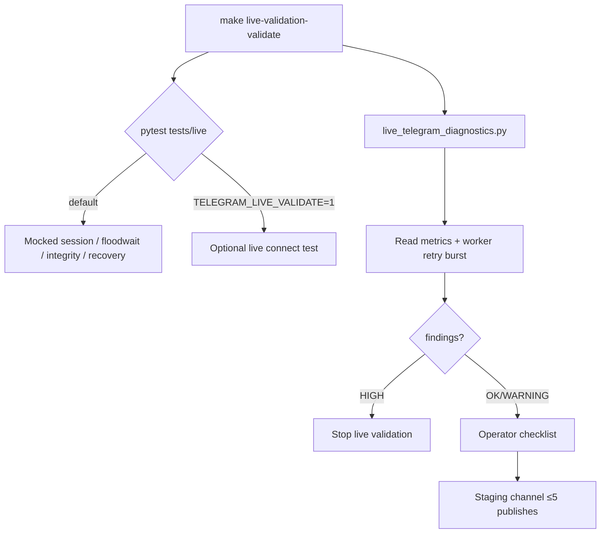
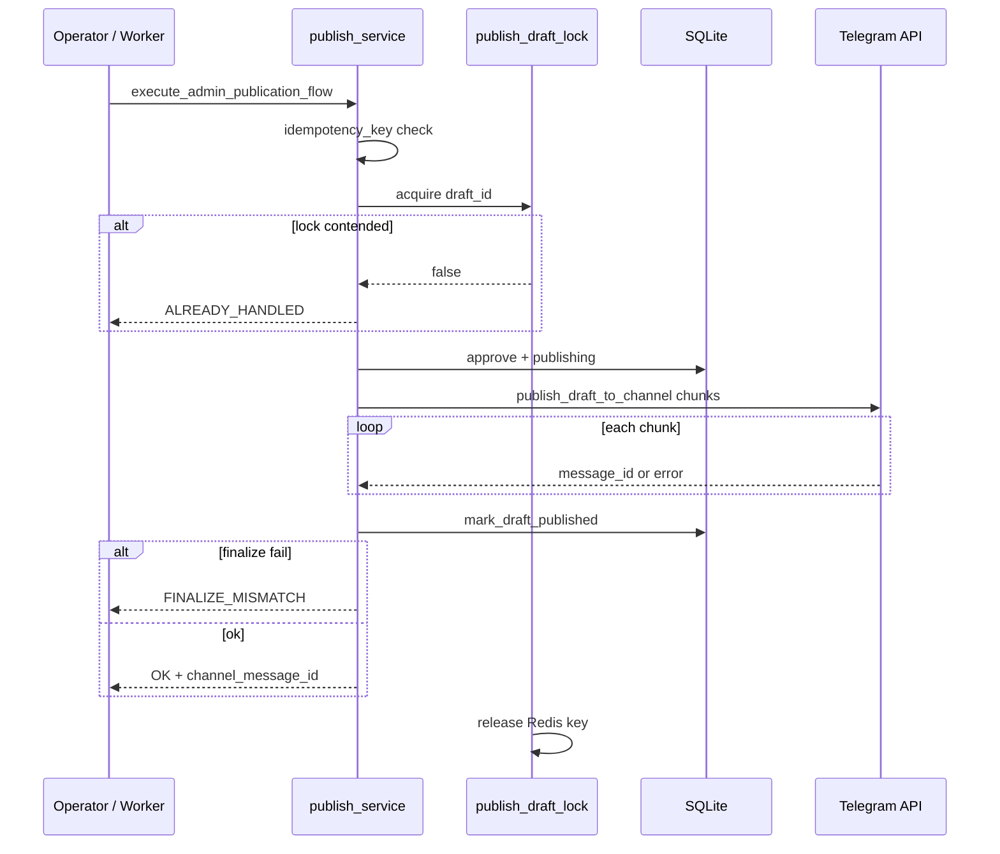
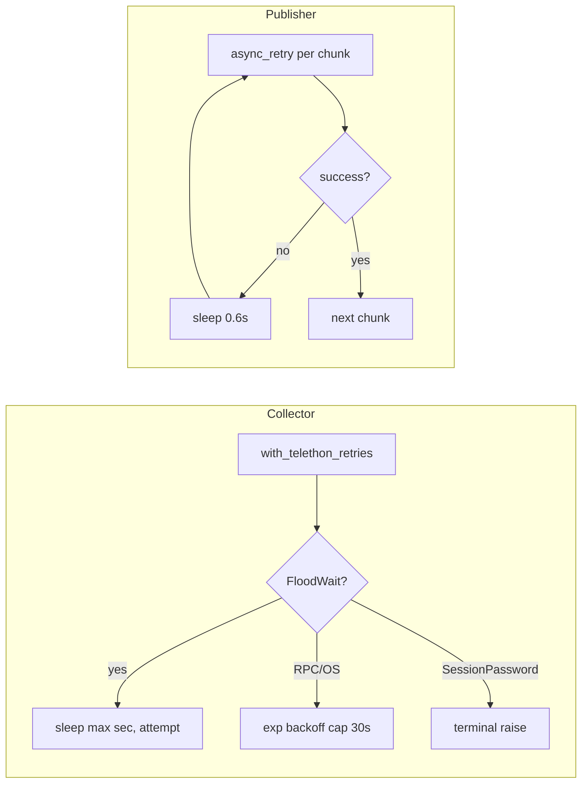
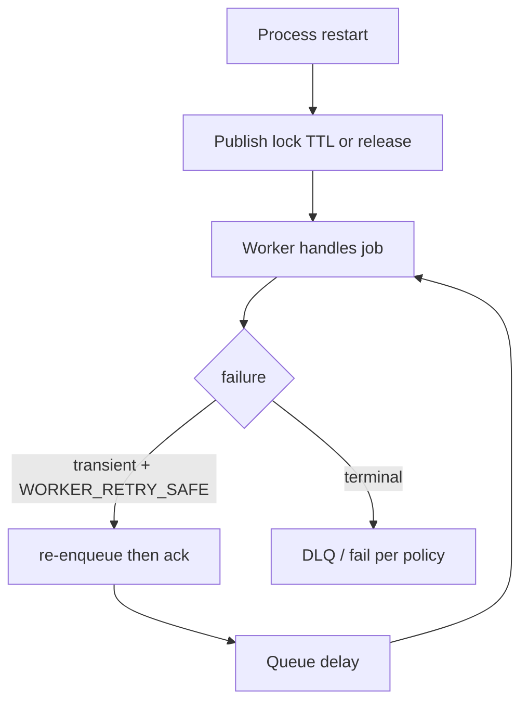
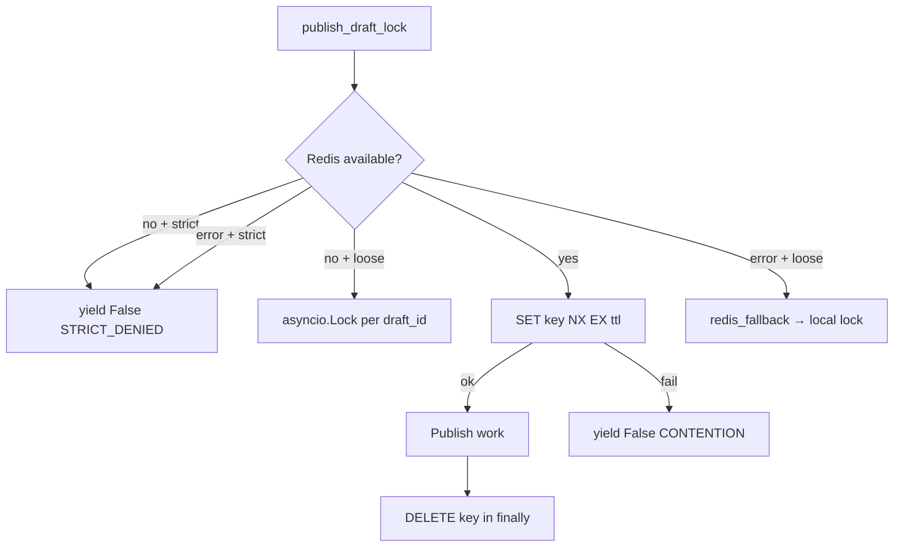

# Live validation runtime flow

Bounded v3 validation against real Telegram runtime conditions. CI exercises mocked paths; live paths are opt-in via `TELEGRAM_LIVE_VALIDATE=1`.

## Validation flow (operator + CI)

## Publish lifecycle

## Retry lifecycle

## Worker recovery lifecycle

## Redis locking model

## Operator workflow boundaries

| Activity | CI / automated | Operator manual |
|----------|----------------|-----------------|
| Telethon reconnect semantics | Mocked tests | 24h session watch |
| Real channel publish | Not in default CI | Staging ≤5 posts |
| DLQ triage | Not automated | Checklist in operator_workflow_validation.md |
| Moderation fatigue | N/A | Sign-off |
| Diagnostics | `live_telegram_diagnostics` | Interpret findings |
| Governance stop | Contract tests | Abort on HIGH findings |

## Boundaries (explicit non-goals)

- No mass production rollout in this phase
- No uncontrolled load / spam patterns
- No changes to frozen `runtime/*.json` contracts
- No mandatory live Telegram in `make ci-test`

## References

- [../live_validation/live_telegram_validation_plan.md](../live_validation/live_telegram_validation_plan.md)
- [../operations/retry_error_matrix.md](../operations/retry_error_matrix.md)
- [../operations/publish_idempotency.md](../operations/publish_idempotency.md)
- ADR-029 live Telegram operational validation
