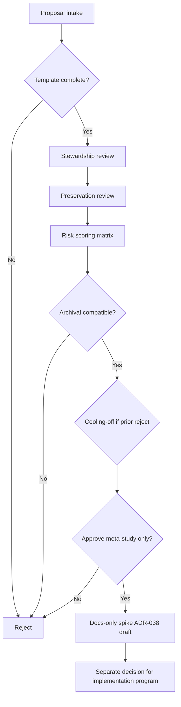

# Governance restart review runbook

**Default outcome:** reject.  
**ADR:** [ADR-037](../architecture/ADR-037-governance-restart-framework.md)

## Flow

## 1. Proposal intake

- Require completed [restart_evaluation_template.md](../governance/restart_evaluation_template.md)
- Label issue/PR: `governance-restart-proposal`
- **No code** in proposal PRs

## 2. Stewardship review

Reviewer: operator on-call + engineering

- Is problem operational vs aesthetic?
- Did hotfix path fail?
- Is cadence in [stewardship_operations_calendar.md](../governance/stewardship_operations_calendar.md) exhausted?

## 3. Preservation review

Reviewer: release manager / governance

- [terminal_state_preservation_addendum.md](../releases/terminal_state_preservation_addendum.md) checklist
- Tags unmoved?
- Archival manifests still valid?

## 4. Risk scoring

Apply [governance_restart_risk_matrix.md](../governance/governance_restart_risk_matrix.md). Any S1 unmitigated → reject.

## 5. Archival compatibility review

Confirm new program uses **new tag namespace** (e.g. `v4-` or `program-2027-`) and does not invalidate v3.2 CI meaning.

## 6. Reject / approve criteria

| Decision | Criteria |
|----------|----------|
| **Reject** | Default; curiosity; platform creep; no evidence |
| **Defer** | Partial evidence; cooling-off |
| **Meta-study** | Strong evidence; docs-only ADR-038 draft allowed |
| **Implementation program** | **Not** decided in this runbook — requires separate ADR chain |

## Mandatory cooling-off period

- **30 days** after rejection before resubmission of same theme
- **90 days** after defer unless new evidence attached

## Automatic rejection examples

| Proposal | Reason |
|----------|--------|
| “Add Grafana dashboard” | Platform creep |
| “Refactor publisher for fun” | No operational failure |
| “Merge ops into runtime metrics loop” | Observability overgrowth |
| “Delete old ADRs to reduce clutter” | Governance erosion |
| PR contains code without ADR-038+ | Process violation |

## Examples requiring new repository

| Situation | Why |
|-----------|-----|
| Fundamentally different product (not newsroom) | Archival lineage confusion |
| GPL-incompatible rewrite from scratch | Legal/lineage break |

*Rare; prefer new tag line in same repo by default.*

## Examples requiring fresh ADR chain

| Situation | ADR |
|-----------|-----|
| Any new tooling subsystem | ADR-038+ scope ADR |
| Runtime semantic change | Separate runtime ADR program |
| New validation gate family | ADR + explicit non-goals |

## References

- [restart_readiness_declaration.md](../releases/restart_readiness_declaration.md)
- [meta_governance_closure.md](../releases/meta_governance_closure.md)
